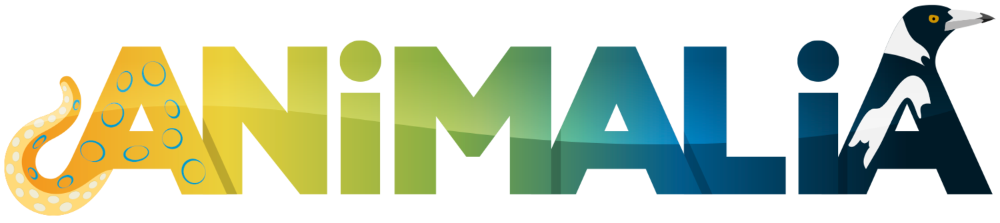

# Animalia




## Contexte

La société « Animalia » gère plusieurs refuges pour animaux le but étant de prendre soin de ses pensionnaires et sur les long termes l’adoption de ses derniers.  
La société voudrait moderniser la manière dont elle gère la liste de ses pensionnaires, les adoptions, les soins effectués et aussi par la même occasion mettre en place une solution pour présenter ses pensionnaires aux futur utilisateurs de son système.  
Jusqu’à présent ceci était fait de manière manuscrite, une tâche qui s’avère parfois longue et pénible.  


## Besoins et informations utiles

Enregistrer un animal  
Consulter la liste des pensionnaires  
Retracer et connaître les informations concernant un animal (numéro de puce, nom, age, sexe, refuges, traitements médicaux, pathologies, ...)  
Enregistrer une personne (un futur maître)  
Enregistrer une adoption  


Concernant chaque animal :

    • Dès qu'un animal est pris en charge pour la première fois dans un des refuges, ce dernier est pucé s'il ne l'est pas déjà. Pour permettre facilement l’identification.  
    • Connaitre ou à défaut attribuer un nom.
    • Identifier son espèce.
    • Pour certaine espèce connaître eventuellement sa race.
    • La date de naissance.
    • Le sexe.
    • L’âge.
    • Ses refuges.
    • Pour chaque refuge, la date d'arrivé et de sortie au refuge.
    • Une description.
    • Savoir si c'est un animal déclaré comme en "SOS".
    • Potentiellement connaître les pathologies de l’animal
    •  Les traitements médicaux que l’animal suit.
    • Des photos de l'animal.
    • Un animal peut changer de refuge (pour un transfert par exemple) un motif peut alors être associé au changement de refuge.
    • Il faut pouvoir retracer les refuges de chaque animal, et connaitre son refuge actuel.


Concernant les adoptions :

    • Chaque adoption est fait par une personne majeur.
      
    • Chaque adoption doit faire l'object d'une cotisation au refuge. La cotisation dépend de l’animal (cotisation libre si l’annimal est en « SOS »).
      
    • Un don en plus de la cotisation peut être fait.
    • La date de l’adoption.
    • Certaines adoptions se passent mal. Le propriétaire a la possibilité de rendre l'animal au refuge.


## Installation et exécution 

### Prérequis
Tout d'abord assurez-vous d'avoir à minima un Java Runtime Environment (JRE) d'installé sur votre machine.  
Si ce n'est pas le cas, visitez <a href="https://www.java.com/fr/">la page d'Oracle</a> pour l'installer
<br><br>

Docker et docker compose sera aussi nécessaire pour l'exécution du projet  
Référez-vous à <a href="https://docs.docker.com/engine/install/">la page officielle Docker</a>, pour l'installer
<br><br>

Téléchargez ensuite les fichiers nécessaires à Animalia <a href="https://github.com/Philippe-CORTEZ/Animalia/releases">ici</a>  
(Prenez la dernière release. Un fichier "docker-compose.yml" et une archive "Animalia.jar")


### Exécution
Une fois tous les fichiers et outils en votre possession, placez-vous dans le même repertoire que les fichiers "docker-compose.yml" et l'archive JAR.   
Lancer en tout premier lieu le serveur avec la commande suivante :  

```bash
docker-compose up  # (pour les versions 1 de docker compose)
docker compose up  # (pour les versions 2 de docker compose)
```

Une fois le serveur lancé, vous pourrez lancer l'application cliente avec la commande :  

```bash
java -jar Animalia.jar  # (ou double clic sur l'archive JAR)
```


## Prochaines étapes

Le projet est bien entendu encore et toujours perfectible, voici quelques points à continuer pour le rendre encore et toujours meilleur :  

Pour la partie cliente
* Retour d'adoption
* Modifier les informations d'un pensionnaire
* Changement de refuge

Pour la partie serveur
* Pagination
* Authentification
* Mise à jour partielle


## Contributeurs

* Philippe CORTEZ
* Jessie RAGOT (Maquettage)
